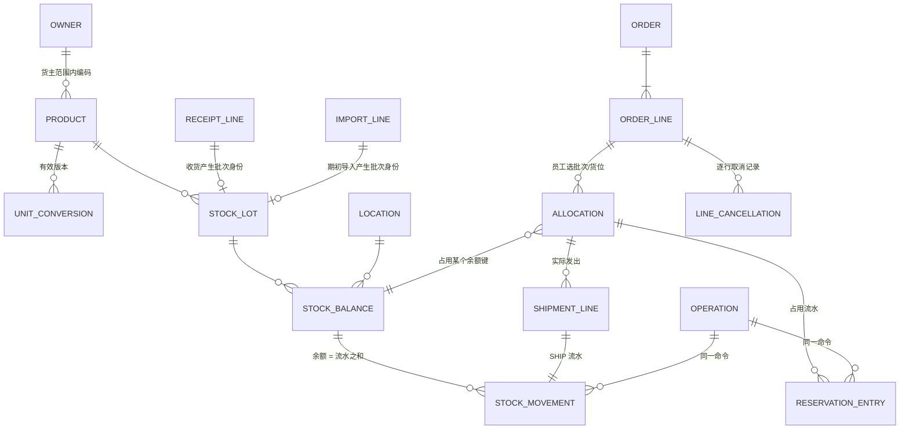
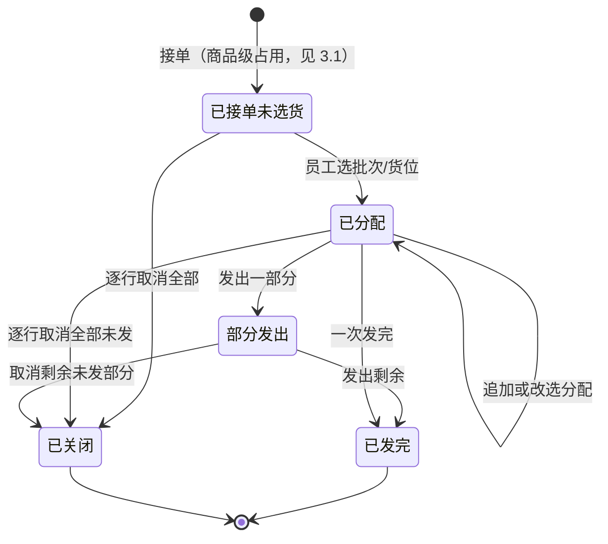

# T02 领域模型、命令与库存不变量

任务：T02 · 作者：Claude Code · 日期：2026-09-27 · 基准：`0388a9e`（启动包导入）
验收关联：A01 A02 A03 A04 A05 A06 A09 A10 · 决策关联：D03 D04 D05 D07 D08

本文是设计文档，**没有实现代码，也没有在数据库上运行**。每条陈述带一个标签：

| 标签 | 含义 |
| --- | --- |
| **[事实]** | PROJECT.md 已确认的业务事实（2026-09-27 两轮答复） |
| **[候选]** | 工程方案，待原型演示和业务确认，可以改 |
| **[待确认]** | 业务未答复；依赖它的实账功能不能上线 |
| **[已验证]** | 有运行证据；本文唯一的运行证据来自 T01 在 InvenTree 上的实测，见 T01 分支的 `docs/fit-gap.md` |

## 1. 对象与关系



| 对象 | 关键字段 | 说明 |
| --- | --- | --- |
| 货主 Owner | id, 名称 | [事实] 可能有多个货主，第一版单货主试运行。货主、下单方、收货方可以不同 |
| 商品 Product | owner_id, code(文本), 中/英名称, 基本单位 | [事实] 编码有前导零。[候选] 唯一键 (owner_id, code)，不同货主同编码是两个商品 |
| 单位换算 UnitConversion | product_id, from_unit, factor, 版本, 生效时间, 确认人 | [候选] 只用已确认的换算；未知单位的行不能过账（AGENTS.md） |
| 批次身份 StockLot | 内部 id, product_id, 来源（收货行或期初导入行）, 外部批号(可空), expiry_date(可空), expiry_status | [事实] 相同效期不等于相同批次（D04）。[候选] 每条收货行、每条期初行各生成一个 StockLot；外部批号缺失时记为"未知"，不根据效期编造 |
| 货位 Location | id, code, 类型(RECEIVING/STORAGE), 是否启用 | [事实] 未上架的合格货可以直接出货，所以 RECEIVING 也是能出货的货位。改名不能改动历史（D03），历史靠流水里的 code 快照 |
| 状态 Condition | PENDING_INSPECTION / AVAILABLE / HOLD / DAMAGED | [候选] 只有 AVAILABLE 计入可用量。"待上架"是货位，不是状态（PROJECT.md：待上架≠未验收） |
| 商品可用汇总 ProductAvailability | 键 = (owner, product)；sellable、reserved、row_version | [候选] 每个货主+商品一行，是**所有改变商品级可用量的命令共同的加锁点**；CHECK (reserved <= sellable)；数据库唯一约束 (owner, product)，**在新建商品的同一事务里创建**（初值 0/0），保证加锁时这一行一定存在，不能靠"锁不到就当没有"。它是流水和占用流水之和的投影，由对账检查核对。2026-09-28 按 Codex 审查 PR #1 补充：没有这一行时，未分配占用分散在各订单行上，两个并发接单锁不到同一行，会超卖 |
| 库存余额 StockBalance | 键 = (owner, product, lot, location, condition)；on_hand、allocated、row_version | [候选] 由流水累计而来的投影，方便加锁和查询；可以随时由流水重建核对 |
| 库存流水 StockMovement | id, operation_id, 类型, 余额键, 数量增减(带符号, 基本单位), location_code 快照, 来源单据及行, 操作人, UTC 时间, 香港业务日期, reverses_id | [候选] 过账后只追加不修改；类型为 OPENING / RECEIPT / MOVE_OUT / MOVE_IN / CONDITION_OUT / CONDITION_IN / SHIP / ADJUST / REVERSAL |
| 订单 Order / 订单行 OrderLine | owner, 外部单号, 来源文件指纹与页/行；行上有 product, qty_ordered, 原始单位与数量, requested_expiry(可空) | [事实] 订单是 PDF，可能指定效期 |
| 分配 Allocation | order_line_id, 余额键, qty_allocated, qty_shipped, qty_released | [事实] 员工决定从哪个效期、批次、货位拿多少。[候选] 分配就是"占用" |
| 占用流水 ReservationEntry | allocation_id, 类型 ALLOCATE(+) / RELEASE(−) / CONSUME(−), qty, operation_id | [候选] 占用变化也只追加，保证取消后仍能看到"曾经占过多少、为什么释放" |
| 出货 Shipment / ShipmentLine | allocation_id, qty, 对应的 SHIP 流水 | 发货时实物减少，同时消耗占用 |
| 逐行取消 LineCancellation | order_line_id, qty, 原因(如未付款), operation_id | [事实] 未付款取消按订单行调整并保留记录。取消原因不代表系统判断了收款 |
| 命令记录 Operation | operation_id(客户端生成), 命令类型, payload 哈希, 结果, 时间 | [候选] 实现幂等（第 5 节） |
| 导入批次 ImportBatch / ImportLine | 文件指纹, 映射版本, 行号, 原始值, 规范值, 行级提示, 状态(预览/确认/过账) | D05；预览不产生流水 |
| 期初快照 OpeningSnapshot | snapshot_at, basis, verified=false | 第 7 节；basis 取值 **[待确认]** |

## 2. 数量分层（D07）

对任意货主 + 商品：

```
实物 on_hand        = Σ StockMovement.qty                         （所有状态、所有货位）
可售实物 sellable    = Σ on_hand where condition = AVAILABLE      （含 RECEIVING 货位）
占用 reserved        = Σ 未发出且未释放的 Allocation 数量 + Σ 订单行未指定货位的占用
可用 available       = sellable − reserved
```

- **[事实]** 有订单时就开始扣业务库存。
- **[候选]** 用"占用"来体现这次扣减：接单只增加占用、减少可用，实物不动；发货时实物减少，同时等量消耗占用，所以可用量不再变化，**发货不会第二次扣可用量**。
- **[已验证]** 这套算法在 InvenTree 1.5.6 上用合成数据跑通：实物 100，占用 20 后可用 80；发出 20 后实物 80、占用 0、可用 80；发货前取消回到 100；先发 8 再取消余下 12，实物和可用都是 92。证据在 T01 分支 `docs/evidence/T01-inventree/`。它证明的是"这个算法可以落地"，**不证明客户认可这种数量含义**（Q03）。

**[待确认]** 界面上"库存"这个词指哪个数。D07 的候选做法是默认显示可用，可以展开查看实物和占用。

## 3. 订单行状态（候选）



每一行始终满足**行数量守恒**（I4）：

```
qty_ordered = 已发出 + 已分配未发 + 未分配占用 + 已取消
```

### 3.1 接单时还没选货位 **[待确认，原型里保留成一个开关]**

[事实] 接单就扣，员工随后才选货。两者之间存在一个时间差，这段时间里商品已经有"占用"，但还不知道占在哪个批次、哪个货位。

- 方案 A（候选默认）：订单行保存一个"未分配占用"数，只减少商品级可用量；员工分配时把它逐步转成具体分配。
- 方案 B：接单时必须同时选货位。更简单，但和"先接单、后选货"的工作习惯不符。

### 3.2 部分发货 **[待确认]**

候选规则：一行可以分多次发。取消只能释放**尚未发出**的部分；已经发出的不能靠"取消"加回来，退回要走单独的退货收货（D07），第一版不做退货流程。

## 4. 不变量

违反下列任何一条，整条命令都要拒绝并回滚。

| # | 不变量 | 对应验收 |
| --- | --- | --- |
| I1 | 每个余额键 on_hand ≥ 0；不能把负数悄悄改成 0 | A06 |
| I2 | 每个余额键上的有效占用 ≤ 该键的 on_hand，且只能占用 AVAILABLE 状态的库存 | A01 A02 A06 |
| I3 | 分配的货主必须等于订单的货主；商品必须等于订单行的商品 | A03 |
| I4 | 订单行数量守恒（见上），占用 + 已发不能超过订购数量 | A05 A10 |
| I5 | 一次移位里，同一 (货主, 商品, 批次, 状态) 的增减之和为 0；MOVE_OUT 和 MOVE_IN 在同一事务写入 | A02 A06 |
| I6 | 发货时 SHIP 流水和 CONSUME 占用流水数量相同、在同一事务里写入 | A02 A10 |
| I7 | 流水和占用流水过账后不修改、不删除；纠错用 REVERSAL 或 ADJUST，并引用原记录 | A04 |
| I8 | 订单行指定了效期时，分配的批次效期必须一致，不能自动换成其他效期 | A03 |
| I9 | 预告不产生流水；导入预览不产生流水 | A01 A08 |
| I10 | 移动已被占用的库存时，把占用一起移到新货位，或者拒绝移动；不能留下指向空货位的占用 | A02 |
| I11 | 每个 (货主, 商品) 的占用合计（已分配未发 + 未分配占用）≤ 可售实物合计；由 ProductAvailability 行在锁内检查，不能只靠单行 CHECK | A06 A10 |

**[已验证]（反例）** 在 InvenTree 上实测时，I2 和 I4 都被违反了：直接调用分配接口时，待检（QUARANTINED）的库存可以被分配（网页表单默认会把它过滤掉，但服务端不拦）；同一个分配请求提交两次，一张 10 件的订单行被分配并发出了 20 件。这说明这两条必须由服务端强制执行，不能只靠界面提醒。见 T01 分支的 `docs/fit-gap.md`。

## 5. 命令、事务边界与幂等

每个命令就是**一个数据库事务**，由集中服务执行（D02）。客户端只负责发请求，不自己计算库存。

| 命令 | 同一事务里写入 |
| --- | --- |
| ConfirmReceipt | StockLot、RECEIPT 流水（状态 PENDING_INSPECTION 或 AVAILABLE）、收货行状态 |
| ChangeCondition（验货通过/不合格） | CONDITION_OUT + CONDITION_IN 流水 |
| MoveStock | MOVE_OUT + MOVE_IN 流水；若涉及已占用的库存，同时调整相应分配（I10） |
| AcceptOrder | 订单、订单行、未分配占用 |
| AllocateLine | Allocation、ALLOCATE 占用流水、行状态 |
| Ship | ShipmentLine、SHIP 流水、CONSUME 占用流水、行状态 |
| CancelLine | LineCancellation、RELEASE 占用流水、行状态 |
| PostImport | 导入行状态、OPENING 或 RECEIPT 流水 |
| Reverse / Adjust | 反向流水或调整流水，引用原记录与原因 |

**事务内的步骤（候选）：**

1. 查 Operation 表：同一个 operation_id、同样的 payload 哈希已经存在，就**直接返回上次的结果**，什么都不写；同一个 id 但 payload 不同，就拒绝（A05）。
2. 先对涉及的 ProductAvailability 行（按 owner、product 排序）执行 `SELECT … FOR UPDATE`，再按固定顺序（余额键排序）锁住涉及的余额行，避免两个请求互相等待造成死锁。规则是：**任何会改变 sellable 或 reserved 的命令，都必须先锁 ProductAvailability 行，并在同一事务里更新它**。按第 5 节命令表逐一对应：ConfirmReceipt（以 AVAILABLE 入账时）、ChangeCondition、MoveStock（移入或移出不可售状态时）、AcceptOrder、AllocateLine、Ship、CancelLine、PostImport（OPENING 或 RECEIPT 以 AVAILABLE 入账时）、Reverse / Adjust（涉及 AVAILABLE 时）。新增命令时要同时判断它是否属于这一类。接单时还没选货位，也会在这一行上排队，从而阻止并发超卖。
3. 在锁内重新读取数量，检查 I1–I11。前端检查过不算数（AGENTS.md）。
4. 写流水、占用流水和单据状态，更新余额投影，写入 Operation 结果。
5. 提交。任何一步失败，整体回滚。

**并发（A06）**：两个订单同时各要占用 4 件，可用只有 5 件。第二个请求在第 2 步等第一个提交，第 3 步重新读到可用 1，于是拒绝。[候选] 具体用 `SELECT … FOR UPDATE` 还是条件更新（`UPDATE … WHERE on_hand - allocated >= :q`），由 T05 选定数据库后决定；必须在真实数据库上做并发测试，内存测试不能证明加锁有效（AGENTS.md）。

**请求重试**：提交成功、但响应在网络上丢了，客户端用**同一个 operation_id** 重发，第 1 步会返回原结果，不会再扣一次。

## 6. 取消与冲正

- CancelLine(line, qty 或"剩余全部", 原因, operation_id)：先释放未分配的占用，再按员工指定（默认按分配创建顺序）释放已分配未发的部分，写 RELEASE 占用流水和一条 LineCancellation。
- **重复取消**：同一个 operation_id 重试时返回原结果。换一个 id 取消一个已经没有可取消余量的行，返回"已无可取消数量"，数量不变（A10）。
- 已发出的数量不能取消。[事实] 已发货的退回需要单独处理。
- 过账错误（例如收货数量录错）：用 REVERSAL 流水冲掉原流水，再按正确数量重新过账。原记录保留，并写明原因和操作人（I7，A04）。

## 7. 期初导入与切换边界（D08，A08）

[事实] 先导入客户系统的数量，之后再盘点。期初数标记为"未盘点核实"；盘点差异用 ADJUST 流水记录，不覆盖期初数。

**[待确认 Q05]** 客户导出的余额属于哪一种：

| basis | 含义 | 导入做法（候选） |
| --- | --- | --- |
| PHYSICAL | 实物数，没有扣掉未出货订单 | on_hand = 导出数；截点前接单但未出货的订单作为"切换订单清单"导入，生成占用，不生成流水 |
| NET_OF_OPEN_ORDERS | 已经扣掉未出货订单的数 | 不能直接当实物：on_hand = 导出数 + 这些订单的未发数量，再生成对应的占用。否则这些订单发货时会**第二次扣减** |
| UNKNOWN | 不清楚 | 只能用于合成数据原型，禁止真实切换 |

- 切换边界 = snapshot_at（导出时刻）。截点之前的订单只能通过切换清单进入系统，不能重放；截点之后的订单在新系统里接单。
- 切换清单里每一行都要带外部单号，靠 Operation 和外部单号防止同一张单被导入两次。
- 截点之后、正式启用之前发生的出货，需要一份人工补录清单。

## 8. 单位与日期

- [候选] 数量一律按商品的基本单位存储；订单原始单位和原始数量作为快照保留。换算用已确认的 UnitConversion 版本，换算结果不是整数、或者单位未知时，这一行不能过账（A07）。
- [候选] 效期是纯日期，不带时区，避免转成 UTC 后提前一天；操作时间存 UTC，业务日期按 Asia/Hong_Kong（D04）。
- **[待确认 Q04]** NG 货、效期未知、跨批次合并出一行等规则。第一版原型对未知情况一律拦下，由人工处理。

## 9. 仍待确认的假设（汇总）

| 假设 | 当前处理 | 阻塞什么 |
| --- | --- | --- |
| Q05 期初余额是实物数还是已扣订单的可用数；快照时刻 | 表 7 的三种做法；原型用 PHYSICAL | 真实数据切换 |
| Q03 界面"库存"指哪个数；部分发货规则 | 默认显示可用，可展开明细；允许部分发货 | 正式启用前的业务验收 |
| 3.1 接单时未选货位如何占用 | 方案 A（商品级未分配占用） | 原型的接单界面 |
| Q04 单位、NG、未知效期 | 一律拦截，人工处理 | 这些情况的实账处理 |
| 可用不足时能否接单（缺货接单） | [候选] 拒绝并提示；未经确认不允许可用量变成负数 | 接单界面 |
