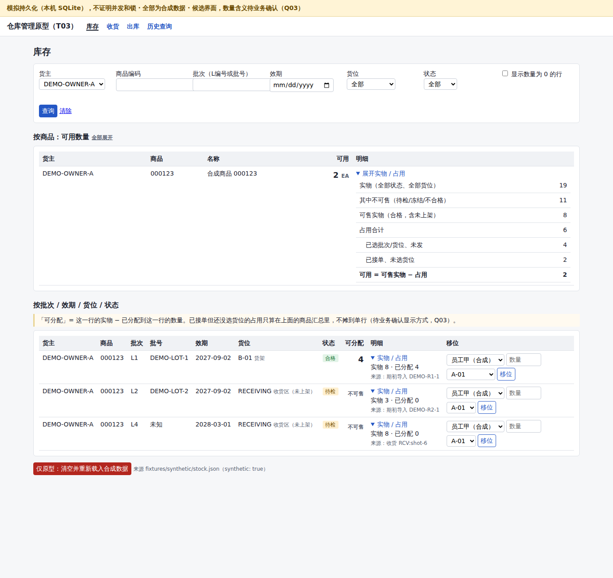
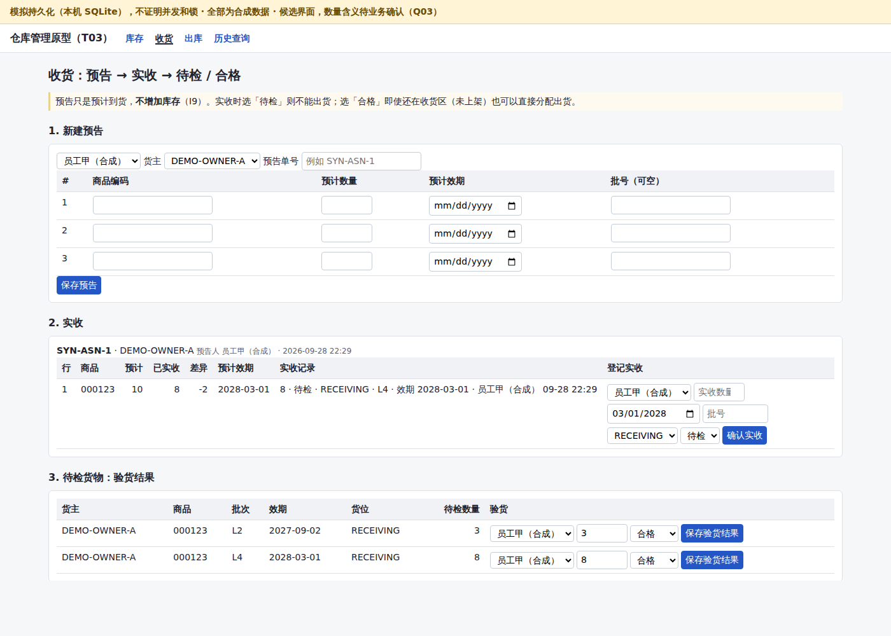
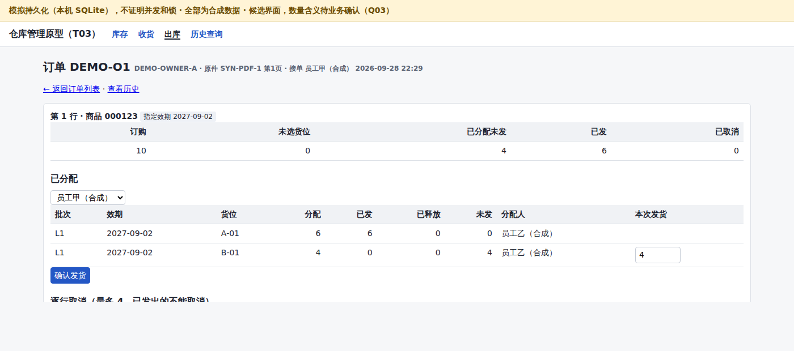
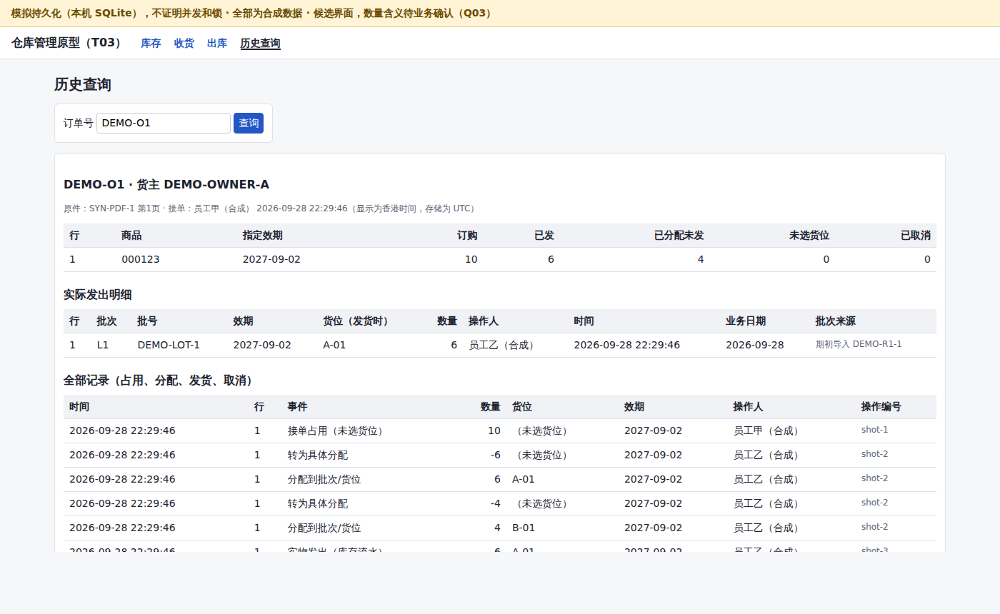

# T03 合成数据下的四屏流程原型

任务：T03 · 作者：Claude Code（云端会话，owner `claude-cloud`）· 日期：2026-09-28 · 基准：`main` `b620443`
验收关联：A01 A02 A03 A09（并覆盖 A10 的数量场景）· 决策关联：D03 D04 D07 D09 · 设计依据：[domain-model.md](domain-model.md)

> **模拟持久化，不证明并发和锁。** 原型用本机 SQLite 单进程运行。Django 的 `select_for_update()` 在 SQLite 上不起作用，所以原型里写好的加锁顺序**没有被验证**。A06（并发）必须在 T06 用 PostgreSQL 18 按 [deployment.md](deployment.md) 第 7 节测试。数据全部是合成数据。

| 标记 | 含义 |
| --- | --- |
| **[事实]** | PROJECT.md 已确认的业务事实 |
| **[候选]** | 原型里的工程做法或界面做法，可改 |
| **[待确认]** | 需要业务答复 |
| **[已验证]** | 本次在 SQLite 上用 pytest 或页面实际运行过（只证明数量算法和拒绝规则，不证明并发） |
| **[未运行验证]** | 没有运行过 |

## 1. 结论

- **[已验证]** D07 的数量分层在原型里按 T02 设计实现，用例全部通过：实物 100，接单 20 后可用 80，发货后实物 80、可用仍 80；先发 8 再取消剩余 12，实物和可用都是 92；重复取消只释放一次；同一 operation_id 重复提交只生效一次，同 id 不同内容被拒绝；待检货不能分配；指定效期不能换成别的效期。pytest 共 42 条（审查修正后），全部通过（第 6 节）。
- **[已验证]** 四个页面能在本机运行，截图见第 4 节。页面只调用领域模块，不自己算数量。
- **[未运行验证]** PostgreSQL、并发、Windows 上运行、打印、PDF/Excel 导入，都没有做。
- **[待确认]** 最重要的问题仍是 Q03：员工口中的「库存」指哪个数（第 8 节）。

## 2. 安装与运行

需要 Python 3.13 和 [uv](https://docs.astral.sh/uv/)。依赖和版本锁在 `prototype/pyproject.toml` 与 `prototype/uv.lock`。

```bash
cd prototype
uv sync                                   # 按 uv.lock 安装到 prototype/.venv
uv run python manage.py migrate           # 建本机 SQLite：prototype/prototype.sqlite3（已被 .gitignore 忽略）
uv run python manage.py load_synthetic    # 载入 fixtures/synthetic/stock.json（可重复运行，按 operation_id 不会重复入账）
uv run python manage.py runserver         # 打开 http://127.0.0.1:8000/
uv run pytest                             # 运行测试（42 条）
```

- 本次在 Linux 云容器上实际运行了以上命令（`runserver` 用 127.0.0.1:8765 截图）。**[未运行验证]** Windows 上的同样命令：uv 和 Django 支持 Windows，但本次没有在 Windows 上运行。
- 环境变量（可选）：`PROTOTYPE_DB`（SQLite 文件路径）、`PROTOTYPE_SECRET_KEY`、`PROTOTYPE_DEBUG`。默认值只适合本机原型。
- 库存页底部的「仅原型：清空并重新载入合成数据」按钮会清空本机原型库。

### 依赖版本（`uv.lock`，2026-09-28 实际安装）

| 组件 | 版本 |
| --- | --- |
| Python | 3.13.12 |
| Django | 5.2.17（LTS 系列，D09） |
| pytest | 9.1.1 |
| pytest-django | 4.14.0 |
| asgiref / sqlparse | 3.12.1 / 0.6.0 |
| 数据库 | SQLite（Python 自带）；**不是** D09 的 PostgreSQL 18 |

## 3. 代码结构

| 路径 | 作用 |
| --- | --- |
| [prototype/inventory/domain.py](../prototype/inventory/domain.py) | **领域命令**，T06 要复用：收货、改状态、移位、接单、分配、发货、逐行取消、期初入账；`operation_id` 幂等；加锁顺序；`check_invariants()` 对账 |
| [prototype/inventory/queries.py](../prototype/inventory/queries.py) | 页面用的只读查询（可用、实物、占用的计算口径） |
| [prototype/inventory/models.py](../prototype/inventory/models.py) | 表结构，对应 domain-model.md 第 1 节；数据库 CHECK 约束 |
| [prototype/inventory/views.py](../prototype/inventory/views.py) | 页面：只解析表单、调用 domain / queries |
| [prototype/inventory/import_preview.py](../prototype/inventory/import_preview.py) | 本机真实文件预览桥接：复用 T04b/T04c 解析器，临时文件解析后删除，不写库存 |
| [prototype/inventory/synthetic.py](../prototype/inventory/synthetic.py) | 通过领域命令载入合成夹具；文件没有 `synthetic: true` 就拒绝 |
| [prototype/tests/](../prototype/tests/test_domain.py) | `test_domain.py`（29 条）、`test_pages.py`（13 条） |

## 4. 四个页面

所有页面顶部都有黄色横幅：「模拟持久化（本机 SQLite），不证明并发和锁 · 全部为合成数据 · 候选界面，数量含义待业务确认（Q03）」。每个表单带一个新生成的 operation_id；同一表单重复提交（例如双击、刷新重发）时，页面提示「已返回第一次的结果，没有再执行一次」。操作人是下拉框里的合成员工，**没有登录和权限**。

截图用无头 Chromium 拍摄，数据是 `fixtures/synthetic/stock.json` 加一个合成场景：DEMO-O1 订 10 件并指定效期 2027-09-02，员工选 A-01 6 件、B-01 4 件，先发出 A-01 的 6 件；另接 SYN-O2 2 件（还没选货位）；预告 SYN-ASN-1 预计 10 件，实收 8 件记为待检。

### 4.1 库存

按货主、商品、批次、效期、货位、状态筛选。上表按商品显示**可用**（默认），展开后显示实物、不可售、可售实物、占用（已分配未发 / 已接单未选货位）。下表按批次/效期/货位/状态显示每行的「可分配」，可展开实物和已分配数量，可移位（只能移动未分配的部分，I10）。



截图中 DEMO-OWNER-A 的 000123：实物 19 = B-01 合格 8 + 收货区待检 3 + 收货区待检 8；可售实物 8；占用 6 = 已分配未发 4 + 未选货位 2；可用 2。

### 4.2 收货

预告（不增加库存）→ 实收（记录实收数量、实收效期、批号、货位，结果为待检或合格）→ 待检货物验货（合格 / 不合格 / 冻结）。实收为合格、放在收货区的货物，不上架也能直接分配出货。



### 4.3 出库

接单即占用（可用不够时拒绝）→ 订单页里员工逐行选批次和货位（只列出同货主、同商品、合格、指定效期一致的库存，系统不自动按效期先出）→ 发货 → 按行取消（可填数量，空表示取消全部剩余；已发出的不能取消）。



### 4.4 历史查询

输入订单号，显示各行数量、实际发出明细（批次、批号、效期、发货时的货位快照、数量、操作人、时间、香港业务日期、批次来源），以及占用、分配、发货、取消的全部记录。



## 5. 规则的实现方式

| 规则 | 原型中的做法 | 对应测试 |
| --- | --- | --- |
| D07 数量分层 | `ProductAvailability` 每个货主+商品一行，存 sellable、reserved；可用 = sellable − reserved。接单只加 reserved；分配把「未选货位占用」转成具体分配，reserved 不变；发货时 sellable 和 reserved 同时减少 | `test_a_*`、`test_b_*`、`test_a10_*` |
| I1 实物不为负 | 余额行 CHECK `on_hand >= 0`，发货前检查 | `test_i1_i2_*` |
| I2 占用 ≤ 实物、只占用合格货 | CHECK `allocated <= on_hand`；分配时检查状态和可分配量 | `test_e_*`、`test_i1_i2_*` |
| I3 货主/商品一致 | 商品编码只在订单货主范围内解析；分配时比对货主和商品 | `test_a03_*` |
| I4 订单行数量守恒 | 每个命令写完后在同一事务里核对：订购 = 已发 + 已分配未发 + 未分配占用 + 已取消 | `test_d_duplicate_allocation_*` |
| I5 移位守恒 | MOVE_OUT 与 MOVE_IN 同一事务；对账检查每次操作增减之和为 0 | `test_a02_*` |
| I6 发货两边同时写 | SHIP 流水和 CONSUME 占用流水同一事务；对账检查数量相等 | `test_a_*`、`test_a02_*` |
| I7 只追加 | 流水、占用流水、取消记录、发货记录的模型禁止修改和删除 | `test_i7_*` |
| I8 指定效期 | 分配时效期必须相同；**[候选]** 另加效期级检查：指定某效期的未分配占用不能超过该效期未分配的合格库存（接单、分配、改状态后都检查） | `test_f_*` |
| I9 预告不产生流水 | 预告只建单据，不写流水 | `test_a01_*` |
| I10 已占用库存移位 | **[候选]** 选「拒绝移动」：只能移动未分配的部分 | `test_i10_*` |
| I11 商品级占用 ≤ 可售 | 所有改变 sellable/reserved 的命令先锁 `ProductAvailability` 行，再锁余额行（按 id 排序），锁内重读并检查；CHECK `reserved <= sellable` 兜底。**SQLite 上锁不生效** | `test_i11_*` |
| A05 幂等 | `Operation` 表以 operation_id 为主键，在事务开始时先插入；同 id 同内容返回原结果，同 id 不同内容拒绝；被拒绝的命令整体回滚，不留下 Operation 行 | `test_c_*`、`test_d_*`、`test_rejected_*` |
| 对账 | `check_invariants()` 用流水和占用流水重算余额、占用、可售并比对。每个测试结束时都运行，必须为空 | 全部测试；`test_reconciliation_*` 故意篡改后能查出 |

**审查修正（2026-09-28，`6b8f005`）**：`move_stock` 和 `change_condition` 原来先锁来源余额行、再锁目标行，分两步加锁，在 PostgreSQL 上 A→B 与 B→A 两个并发移位可能死锁；现改为先创建目标行（不加锁），再把来源和目标**一次按 id 排序锁住**（`test_*_in_one_sorted_step`）。页面层的分配、取消会校验订单行属于当前订单，表单里非数字的编号会被拒绝而不是报 500（`test_*_another_order_*`、`test_non_numeric_ids_*`）。**SQLite 上锁不生效，死锁本身没有被运行验证**，测试检查的是加锁调用的顺序。

测试能分辨对错的抽查（本次手工做了两次临时变异，未提交）：让发货不减少占用 → 4 条失败、3 条出错；去掉「已无可取消数量」检查和「待检不能分配」检查 → 3 条失败、1 条出错。还原后当时的 36 条全部通过（修正前）。

## 6. pytest 实际输出

2026-09-28，在 Linux 云容器上运行 `cd prototype && uv run pytest -v -p no:cacheprovider`（路径已替换为 `<repo>`）：

2026-09-28 审查修正后（提交 `6b8f005`），本机 Claude Code 在 macOS（Python 3.13.5、Django 5.2.17、pytest 9.1.1、pytest-django 4.14.0，pip 安装）上重新运行 `python -m pytest -v`，输出如下（只保留结果行）。修正前云端运行结果为 36 passed（Linux，uv）；本轮新增 6 条回归测试，用修正前的代码运行这 6 条全部失败。

```
tests/test_domain.py::test_a_accept_20_of_100_then_ship_keeps_available_80 PASSED [  2%]
tests/test_domain.py::test_a10_cancel_before_ship_returns_to_100 PASSED  [  4%]
tests/test_domain.py::test_b_ship_8_then_cancel_remaining_12_ends_at_92 PASSED [  7%]
tests/test_domain.py::test_c_same_cancel_submitted_twice_releases_once PASSED [  9%]
tests/test_domain.py::test_c_second_full_cancel_with_new_id_changes_nothing PASSED [ 11%]
tests/test_domain.py::test_d_same_operation_id_applies_once PASSED       [ 14%]
tests/test_domain.py::test_d_same_operation_id_different_content_is_rejected PASSED [ 16%]
tests/test_domain.py::test_d_duplicate_allocation_cannot_over_allocate_line PASSED [ 19%]
tests/test_domain.py::test_e_pending_inspection_stock_cannot_be_allocated PASSED [ 21%]
tests/test_domain.py::test_e_inspection_pass_makes_stock_allocatable_in_receiving PASSED [ 23%]
tests/test_domain.py::test_unknown_condition_is_rejected_not_treated_as_available PASSED [ 26%]
tests/test_domain.py::test_f_requested_expiry_cannot_be_swapped PASSED   [ 28%]
tests/test_domain.py::test_f_accept_rejected_when_requested_expiry_short PASSED [ 30%]
tests/test_domain.py::test_f_unspecified_line_cannot_take_stock_reserved_for_an_expiry PASSED [ 33%]
tests/test_domain.py::test_a01_notice_adds_nothing_receipt_counts_and_receiving_stock_ships PASSED [ 35%]
tests/test_domain.py::test_a02_multi_location_allocation_and_move_with_fixture PASSED [ 38%]
tests/test_domain.py::test_fixture_load_is_idempotent PASSED             [ 40%]
tests/test_domain.py::test_a03_other_owner_stock_cannot_be_allocated PASSED [ 42%]
tests/test_domain.py::test_a03_owner_b_cannot_order_owner_a_stock_by_same_code PASSED [ 45%]
tests/test_domain.py::test_a03_same_expiry_different_receipts_stay_separate_lots PASSED [ 47%]
tests/test_domain.py::test_i10_allocated_stock_cannot_be_moved PASSED    [ 50%]
tests/test_domain.py::test_i11_accept_beyond_available_is_rejected PASSED [ 52%]
tests/test_domain.py::test_i11_hold_cannot_push_reserved_above_sellable PASSED [ 54%]
tests/test_domain.py::test_i1_i2_cannot_allocate_more_than_free PASSED   [ 57%]
tests/test_domain.py::test_i7_posted_rows_are_append_only PASSED         [ 59%]
tests/test_domain.py::test_rejected_command_writes_nothing_and_leaves_no_operation PASSED [ 61%]
tests/test_domain.py::test_reconciliation_detects_tampered_projection PASSED [ 64%]
tests/test_domain.py::test_move_locks_source_and_destination_in_one_sorted_step PASSED [ 66%]
tests/test_domain.py::test_condition_change_locks_both_rows_in_one_sorted_step PASSED [ 69%]
tests/test_pages.py::test_every_page_shows_simulation_notice[inventory] PASSED [ 71%]
tests/test_pages.py::test_every_page_shows_simulation_notice[receiving] PASSED [ 73%]
tests/test_pages.py::test_every_page_shows_simulation_notice[outbound] PASSED [ 76%]
tests/test_pages.py::test_every_page_shows_simulation_notice[history] PASSED [ 78%]
tests/test_pages.py::test_inventory_defaults_to_available_with_expandable_detail PASSED [ 80%]
tests/test_pages.py::test_full_outbound_flow_and_history PASSED          [ 83%]
tests/test_pages.py::test_double_submit_same_form_is_replayed_not_repeated PASSED [ 85%]
tests/test_pages.py::test_rejection_is_shown_and_writes_nothing PASSED   [ 88%]
tests/test_pages.py::test_receiving_flow_notice_receipt_inspection PASSED [ 90%]
tests/test_pages.py::test_cancel_with_line_of_another_order_is_rejected PASSED [ 92%]
tests/test_pages.py::test_allocate_with_line_of_another_order_is_rejected PASSED [ 95%]
tests/test_pages.py::test_non_numeric_ids_in_form_are_rejected_not_500[allocate-pick_abc] PASSED [ 97%]
tests/test_pages.py::test_non_numeric_ids_in_form_are_rejected_not_500[ship-ship_abc] PASSED [100%]
============================== 42 passed in 1.30s ==============================
```

这些测试**不包括**：并发测试（A06，需要 PostgreSQL）、Windows、浏览器兼容性。

## 7. 哪些是模拟的

| 项目 | 原型里的做法 | 正式版本需要 |
| --- | --- | --- |
| 数据库 | SQLite 单文件，单进程 | PostgreSQL 18（D09），并发测试（A06） |
| 加锁 | 代码按 D09 的顺序调用 `select_for_update()`，SQLite 上不起作用 | 在 PostgreSQL 上按 deployment.md 7.3 验证 |
| 登录与权限 | 没有；操作人从下拉框选（合成员工） | A14：服务端权限、按货主隔离 |
| 期初数据 | 合成夹具按 OPENING 流水入账；`basis` 视为未知 | Q05 答复后按 domain-model.md 第 7 节切换 |
| 订单来源 | 手工输入，「原件」只是一段文字 | PDF 解析与人工确认（D05、A07/A09 的原件映射） |
| 单位 | 只用基本单位 EA，没有换算 | 已确认的换算版本（Q04） |
| 冲正与调整 | 没有做 | REVERSAL / ADJUST 命令（I7、A04） |
| 退货 | 没有做 | 退货验收流程（D07） |
| 板头纸、打印 | 没有做 | 后续任务；专用打印暂缓（Q06），非首期阻塞 |
| 清空重载按钮 | 仅原型使用 | 正式系统不能有 |
| 界面语言 | 简体中文 | 繁体为候选（PROJECT.md），待确认 |

## 8. 需要业务确认的界面问题

1. **Q03：员工看到的「库存」指哪个数？** 原型默认显示「可用 = 合格实物 − 占用」，展开才看到实物和占用。截图里的例子：实物 19、可用 2。员工平时说的「还有多少」是 19、8（合格实物）还是 2？如果是实物，接单后员工会觉得「数量没变」；如果是可用，员工到货架上数到的数量会比屏幕上多。
2. **按货位的一行显示什么？** 原型每行显示「可分配 = 这一行实物 − 已分配到这一行」，已接单但还没选货位的占用只在商品汇总里扣，不摊到某个货位。员工能接受「各货位的可分配加起来大于商品可用」吗？
3. **可用不够时能不能接单（缺货接单）？** 原型直接拒绝。
4. **接单和选货位是否分开两步？** 原型按 domain-model.md 3.1 方案 A：接单先占用商品，再由员工选批次和货位。是否需要接单时就必须选货位（方案 B）？
5. **一行能不能分几次发货？** 原型允许（部分发货），取消只能取消没发出的部分。
6. **取消原因**：原型提供「客户未付款 / 客户要求 / 其他」。是否还需要别的原因，是否必须填写备注？
7. **实收和预告数量不一样时怎么处理？** 原型允许实收多于或少于预告，只显示差异，不要求审批。
8. **验货不合格、冻结的货物**：原型只把状态改掉，不能出货。是否需要单独的处理流程（退回、报废）？
9. **已分配的货能不能移位？** 原型拒绝，要先改分配。现场是否常有「已备货但要挪位置」的情况？
10. **界面语言**：简体还是繁体，商品名是否同时显示中英文？

## 9. 与验收的对应

| 验收 | 原型覆盖的部分 | 没有覆盖的部分 |
| --- | --- | --- |
| A01 | [已验证] 预告 10 → 库存 0；实收 8 → 8；从收货区出 3 → 剩 5 | 真实 Excel 到货表导入 |
| A02 | [已验证] A 位 6 + B 位 4 分配后可用 4；发出后 B 剩 4、可用 4；移位 2 后总量不变 | stage 是 database：需要在 PostgreSQL 上验证 |
| A03 | [已验证] 不同货主同编码不能互扣；指定效期不能换；同效期不同来源是不同批次 | 同上 |
| A09 | [已验证] 按订单号查到效期、货位、数量、操作人、时间 | 原件版本、行号映射（需要 PDF 导入） |
| A10 | [已验证] 100/20/80、取消回到 100、先发 8 再取消 12 得 92、重复取消不再加 | 同上，database 阶段 |

acceptance.json 里各项状态**没有改**：它们的 stage 是 database 或 end_to_end，SQLite 原型不满足。
